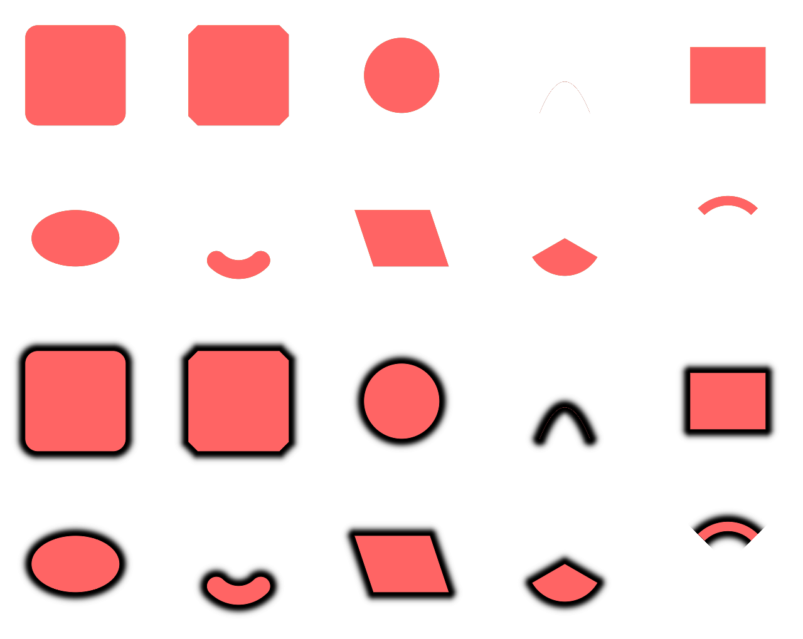
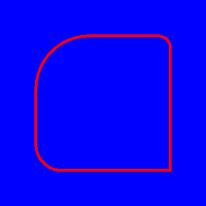
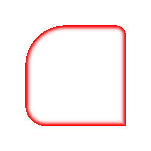
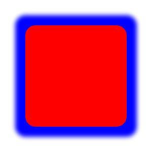

# SDFY - Signed Distance Functions for Nim

A high-performance Nim library implementing 2D signed distance functions (SDFs) with multiple rendering modes and SIMD optimizations.

## Features

- **Fast SDF Implementation**: Optimized implementations of common 2D shapes
- **Multiple Rendering Modes**: Support for various anti-aliasing and effect techniques
- **SIMD Acceleration**: Leverages SIMD instructions for maximum performance
- **Pixie Integration**: Seamless integration with the Pixie graphics library
- **Flexible API**: Easy-to-use interface for rendering SDFs to images

## Supported Shapes

- **Rounded Rectangle**: Fully configurable rounded rectangles with independent corner radii
- **Chamfer Box**: Rectangles with chamfered (cut) corners
- **Circle**: Perfect circles with configurable radius
- **Box**: Simple rectangles/boxes with sharp corners
- **Ellipse**: Elliptical shapes with configurable semi-axes
- **Quadratic Bézier Curve**: Smooth curves defined by three control points
- **Arc**: Circular arc segments with configurable aperture and thickness
- **Parallelogram**: Four-sided shapes with parallel opposite sides and configurable skew
- **Pie**: Pie slice/sector shapes with configurable aperture and radius
- **Ring**: Ring/annular segments with configurable aperture, radius, and thickness

## Rendering Modes

- **Clip**: Sharp edges without anti-aliasing
- **Clip AA**: Sharp edges with anti-aliasing  
- **Annular**: Creates ring/annular shapes
- **Annular AA**: Anti-aliased ring shapes
- **Feather**: Standard anti-aliased edges with customizable factor
- **Feather Inverse**: Inverted feather anti-aliasing
- **Feather Gaussian**: Gaussian-based anti-aliasing for smooth edges
- **Drop Shadow**: Gaussian-based drop shadow effects
- **Inset Shadow**: Inner shadow effects
- **Inset Shadow Annular**: Annular inner shadow effects

## Performance

| Mode | With SIMD | Without SIMD | Speedup |
|------|-----------|--------------|---------|
| **Pixie Shadow** | **456 ms** | **476 ms** | **1.0x** |
| Clip | 5 ms | 20 ms | 4.0x |
| Clip AA | 6 ms | 30 ms | 5.0x |
| Annular | 5 ms | 22 ms | 4.4x |
| Annular AA | 6 ms | 33 ms | 5.5x |
| Feather | 6 ms | 23 ms | 3.8x |
| Feather Inverse | 6 ms | 26 ms | 4.3x |
| Feather Gaussian | 7 ms | 24 ms | 3.4x |
| Drop Shadow | 7 ms | 24 ms | 3.4x |
| Inset Shadow | 8 ms | 24 ms | 3.0x |
| Inset Shadow Annular | 7 ms | 24 ms | 3.4x |

*Performance measured on rounded rectangles (300x300 image). SIMD provides 3-5x performance improvement. **SDF functions are 15-65x faster than traditional Pixie rendering with shadows.***

**Shape-specific Performance:**
- **Simple shapes** (Circle, Box): Fastest rendering, full SIMD optimization
- **Medium complexity** (Rounded Box, Chamfer Box, Arc, Pie, Ring): Good SIMD optimization
- **Complex shapes** (Ellipse, Bézier, Parallelogram): Partial SIMD optimization with scalar fallbacks for complex math

## Examples

Here's a grid with all the currently supported SDF functions, with and without a dropshadow: 



Here are examples of the different rendering modes applied to rounded rectangles:

### Clip Mode (Sharp Edges)


### Clip AA Mode (Anti-aliased Edges)


### Annular Mode (Ring Shape)


### Annular AA Mode (Anti-aliased Ring)


### Feather Mode (Standard Anti-aliasing)


### Feather Inverse Mode (Inverted Anti-aliasing)


### Feather Gaussian Mode (Gaussian Anti-aliasing)


### Drop Shadow Mode


### Inset Shadow Mode


### Inset Shadow Annular Mode


### Pixie Comparison (Traditional Graphics)


## Installation

Add to your `.nimble` file:

```nim
requires "sdfy"
```

Or install directly:

```bash
nimble install sdfy
```

## Quick Start

```nim
import pixie
import sdfy

let image = newImage(300, 300)
let center = vec2(150.0, 150.0)
let size = vec2(200.0, 200.0)
let corners = vec4(0.0, 20.0, 40.0, 80.0)  # Different radius per corner
let fillColor = rgba(255, 0, 0, 255)        # Red fill
let bgColor = rgba(0, 0, 255, 255)          # Blue background

# Render a rounded rectangle with anti-aliasing
drawSdfShape(
  image,
  center = center,
  wh = size,
  params = RoundedBoxParams(r: corners),
  pos = fillColor,
  neg = bgColor,
  mode = sdfModeFeatherInv
)

image.writeFile("output.png")
```

## API Reference

### Core Functions

#### `sdRoundedBox(p: Vec2, b: Vec2, r: Vec4): float32`

Calculate the signed distance from a point to a rounded rectangle.

- `p`: Point to test
- `b`: Box half-extents (width/2, height/2)  
- `r`: Corner radii as Vec4 (x=top-right, y=bottom-right, z=bottom-left, w=top-left)
- Returns: Signed distance (negative inside, positive outside)

#### `sdChamferBox(p: Vec2, b: Vec2, chamfer: float32): float32`

Calculate the signed distance from a point to a chamfered rectangle.

- `p`: Point to test
- `b`: Box half-extents (width/2, height/2)
- `chamfer`: Chamfer amount
- Returns: Signed distance (negative inside, positive outside)

#### `sdCircle(p: Vec2, r: float32): float32`

Calculate the signed distance from a point to a circle.

- `p`: Point to test
- `r`: Circle radius
- Returns: Signed distance (negative inside, positive outside)

#### `sdBox(p: Vec2, b: Vec2): float32`

Calculate the signed distance from a point to a box/rectangle.

- `p`: Point to test
- `b`: Box half-extents (width/2, height/2)
- Returns: Signed distance (negative inside, positive outside)

#### `sdEllipse(p: Vec2, ab: Vec2): float32`

Calculate the signed distance from a point to an ellipse.

- `p`: Point to test
- `ab`: Ellipse semi-axes (width/2, height/2)
- Returns: Signed distance (negative inside, positive outside)

#### `sdBezier(p: Vec2, A: Vec2, B: Vec2, C: Vec2): float32`

Calculate the signed distance from a point to a quadratic Bézier curve.

- `p`: Point to test
- `A`, `B`, `C`: Control points of the Bézier curve
- Returns: Distance to the curve (always positive for curves)

#### `sdArc(p: Vec2, sc: Vec2, ra: float32, rb: float32): float32`

Calculate the signed distance from a point to an arc.

- `p`: Point to test
- `sc`: Sin/cos of the arc's aperture (sc.x = sin, sc.y = cos)
- `ra`: Inner radius
- `rb`: Thickness (outer radius difference)
- Returns: Signed distance (negative inside, positive outside)

#### `sdParallelogram(p: Vec2, wi: float32, he: float32, sk: float32): float32`

Calculate the signed distance from a point to a parallelogram.

- `p`: Point to test
- `wi`: Width
- `he`: Height
- `sk`: Skew
- Returns: Signed distance (negative inside, positive outside)

#### `sdPie(p: Vec2, c: Vec2, r: float32): float32`

Calculate the signed distance from a point to a pie slice.

- `p`: Point to test
- `c`: Sin/cos of the pie's aperture (c.x = sin, c.y = cos)
- `r`: Radius
- Returns: Signed distance (negative inside, positive outside)

#### `sdRing(p: Vec2, n: Vec2, r: float32, th: float32): float32`

Calculate the signed distance from a point to a ring.

- `p`: Point to test
- `n`: Sin/cos of the ring's aperture (n.x = sin, n.y = cos)
- `r`: Radius
- `th`: Thickness
- Returns: Signed distance (negative inside, positive outside)

#### `drawSdfShape(image, center, wh, params, pos, neg, factor, spread, mode)`

Generic function to render shapes to an image using SDF.

- `image`: Target image to render to
- `center`: Center position of the shape
- `wh`: Width and height of the shape (ignored for some shapes like circles, arcs, etc.)
- `params`: Shape parameters (see Shape Parameters section)
- `pos`: Color for inside the shape
- `neg`: Color for outside the shape
- `factor`: Anti-aliasing factor (default: 4.0)
- `spread`: Spread amount for shadow effects (default: 0.0)
- `mode`: Rendering mode (see SDFMode enum)

### Shape Parameters

```nim
type
  RoundedBoxParams* = object
    r*: Vec4  # corner radii (top-right, bottom-right, bottom-left, top-left)
  
  ChamferBoxParams* = object
    chamfer*: float32  # chamfer amount
  
  CircleParams* = object
    r*: float32  # radius

  BoxParams* = object
    b*: Vec2  # box half-extents (width/2, height/2)

  EllipseParams* = object
    ab*: Vec2  # ellipse semi-axes (width/2, height/2)

  BezierParams* = object
    A*: Vec2  # first control point
    B*: Vec2  # second control point
    C*: Vec2  # third control point

  ArcParams* = object
    sc*: Vec2  # sin/cos of the arc's aperture
    ra*: float32  # inner radius
    rb*: float32  # thickness (outer radius difference)

  ParallelogramParams* = object
    wi*: float32  # width
    he*: float32  # height
    sk*: float32  # skew

  PieParams* = object
    c*: Vec2  # sin/cos of the pie's aperture
    r*: float32  # radius

  RingParams* = object
    n*: Vec2  # sin/cos of the ring's aperture (n.x = sin, n.y = cos)
    r*: float32  # radius
    th*: float32  # thickness
```

### Rendering Modes

```nim
type SDFMode* = enum
  sdfModeFeather              # Standard anti-aliasing
  sdfModeFeatherInv           # Inverted anti-aliasing
  sdfModeClip                 # Sharp edges without anti-aliasing
  sdfModeClipAA               # Sharp edges with anti-aliasing
  sdfModeFeatherGaussian      # Gaussian anti-aliasing
  sdfModeDropShadow           # Drop shadow effect
  sdfModeInsetShadow          # Inset shadow effect
  sdfModeInsetShadowAnnular   # Annular inset shadow effect
  sdfModeAnnular              # Ring/annular shape
  sdfModeAnnularAA            # Anti-aliased ring/annular shape
```

## Image Compatibility

SDFY is designed to work with multiple image types through a flexible generic interface. You can use:

- **Pixie Image**: The standard `pixie.Image` type from the Pixie graphics library
- **SdfImage**: The included `SdfImage` type for lightweight image operations
- **Custom Image Types**: Any type that implements the required interface

### Required Image Interface

For an image type to work with SDFY's `drawSdfShape` function, it must provide:

```nim
# Required fields/properties:
image.width: int       # Image width in pixels
image.height: int      # Image height in pixels
image.data: seq[ColorRGBX]  # Pixel data as RGBX color sequence

# Required function/template:
image.dataIndex(x, y: int): int  # Calculate array index for pixel at (x, y)
```

### Implementation Example

```nim
type
  CustomImage* = object
    width*, height*: int
    data*: seq[ColorRGBX]

# Implement the dataIndex template
template dataIndex*(image: CustomImage, x, y: int): int =
  image.width * y + x

# Now you can use it with SDFY
let myImage = CustomImage(width: 300, height: 300)
myImage.data = newSeq[ColorRGBX](300 * 300)

drawSdfShape(
  myImage,  # Works with any compatible image type
  center = vec2(150, 150),
  wh = vec2(200, 200),
  params = CircleParams(r: 100.0),
  pos = rgba(255, 100, 100, 255),
  neg = rgba(50, 50, 50, 255),
  mode = sdfModeFeatherInv
)
```

### SdfImage vs Pixie Image

- **SdfImage**: Lightweight, minimal dependencies, included with SDFY
- **Pixie Image**: Full-featured graphics library with extensive drawing capabilities, file I/O, and more

Both types implement the same interface and can be used interchangeably with SDFY functions.

## Examples

### Basic Rounded Rectangle

```nim
import pixie, sdfy

let image = newImage(300, 300)
drawSdfShape(
  image,
  center = vec2(150, 150),
  wh = vec2(200, 200),
  params = RoundedBoxParams(r: vec4(20, 20, 20, 20)),  # 20px radius on all corners
  pos = rgba(255, 100, 100, 255),
  neg = rgba(50, 50, 50, 255),
  mode = sdfModeFeatherInv
)
```

### Asymmetric Corners

```nim
# Different radius for each corner
let corners = vec4(
  0.0,   # top-right: sharp corner
  20.0,  # bottom-right: small radius
  40.0,  # bottom-left: medium radius  
  80.0   # top-left: large radius
)

drawSdfShape(
  image,
  center = center,
  wh = size,
  params = RoundedBoxParams(r: corners),
  pos = fill,
  neg = bg,
  mode = sdfModeFeatherInv
)
```

### Drop Shadow Effect

```nim
drawSdfShape(
  image,
  center = vec2(150, 150),
  wh = vec2(200, 200),
  params = RoundedBoxParams(r: vec4(20, 20, 20, 20)),
  pos = rgba(255, 255, 255, 255),
  neg = rgba(0, 0, 0, 0),
  factor = 10.0,
  spread = 20.0,
  mode = sdfModeDropShadow
)
```

### Chamfer Box

```nim
drawSdfShape(
  image,
  center = vec2(150, 150),
  wh = vec2(200, 200),
  params = ChamferBoxParams(chamfer: 20.0),
  pos = rgba(255, 100, 100, 255),
  neg = rgba(50, 50, 50, 255),
  mode = sdfModeFeatherInv
)
```

### Circle

```nim
drawSdfShape(
  image,
  center = vec2(150, 150),
  wh = vec2(200, 200),  # ignored for circles
  params = CircleParams(r: 100.0),
  pos = rgba(255, 100, 100, 255),
  neg = rgba(50, 50, 50, 255),
  mode = sdfModeFeatherInv
)
```

### Box (Rectangle)

```nim
drawSdfShape(
  image,
  center = vec2(150, 150),
  wh = vec2(200, 200),  # ignored for boxes since we specify half-extents directly
  params = BoxParams(b: vec2(80.0, 60.0)),  # 160x120 pixel box
  pos = rgba(255, 100, 100, 255),
  neg = rgba(50, 50, 50, 255),
  mode = sdfModeFeatherInv
)
```

### Ellipse

```nim
drawSdfShape(
  image,
  center = vec2(150, 150),
  wh = vec2(200, 200),  # ignored for ellipses since we specify semi-axes directly
  params = EllipseParams(ab: vec2(90.0, 60.0)),  # 180x120 pixel ellipse
  pos = rgba(255, 100, 100, 255),
  neg = rgba(50, 50, 50, 255),
  mode = sdfModeFeatherInv
)
```

### Quadratic Bézier Curve

```nim
drawSdfShape(
  image,
  center = vec2(150, 150),
  wh = vec2(200, 200),  # ignored for Bézier curves
  params = BezierParams(
    A: vec2(50.0, 100.0),   # Start point (relative to center)
    B: vec2(0.0, -50.0),    # Control point
    C: vec2(-50.0, 100.0)   # End point
  ),
  pos = rgba(255, 100, 100, 255),
  neg = rgba(50, 50, 50, 255),
  mode = sdfModeFeatherInv
)
```

### Arc

```nim
drawSdfShape(
  image,
  center = vec2(150, 150),
  wh = vec2(200, 200),  # ignored for arcs
  params = ArcParams(
    sc: vec2(sin(PI/4), cos(PI/4)),  # 45 degree aperture
    ra: 80.0,   # inner radius
    rb: 20.0    # thickness
  ),
  pos = rgba(255, 100, 100, 255),
  neg = rgba(50, 50, 50, 255),
  mode = sdfModeFeatherInv
)
```

### Parallelogram

```nim
drawSdfShape(
  image,
  center = vec2(150, 150),
  wh = vec2(200, 200),  # ignored for parallelograms
  params = ParallelogramParams(
    wi: 80.0,   # width
    he: 60.0,   # height
    sk: 20.0    # skew
  ),
  pos = rgba(255, 100, 100, 255),
  neg = rgba(50, 50, 50, 255),
  mode = sdfModeFeatherInv
)
```

### Pie Slice

```nim
drawSdfShape(
  image,
  center = vec2(150, 150),
  wh = vec2(200, 200),  # ignored for pies
  params = PieParams(
    c: vec2(sin(PI/3), cos(PI/3)),  # 60 degree aperture
    r: 80.0   # radius
  ),
  pos = rgba(255, 100, 100, 255),
  neg = rgba(50, 50, 50, 255),
  mode = sdfModeFeatherInv
)
```

### Ring

```nim
drawSdfShape(
  image,
  center = vec2(150, 150),
  wh = vec2(200, 200),  # ignored for rings
  params = RingParams(
    n: vec2(sin(PI/4), cos(PI/4)),  # 45 degree aperture
    r: 80.0,   # radius
    th: 20.0   # thickness
  ),
  pos = rgba(255, 100, 100, 255),
  neg = rgba(50, 50, 50, 255),
  mode = sdfModeFeatherInv
)
```

## Inspiration

This library is based on the excellent work by [Íñigo Quílez](https://iquilezles.org/articles/distfunctions2d/) on 2D distance functions.

## License

Licensed under the Apache License 2.0. See LICENSE file for details.

## Contributing

Contributions are welcome! Please feel free to submit pull requests or open issues for bugs and feature requests. 